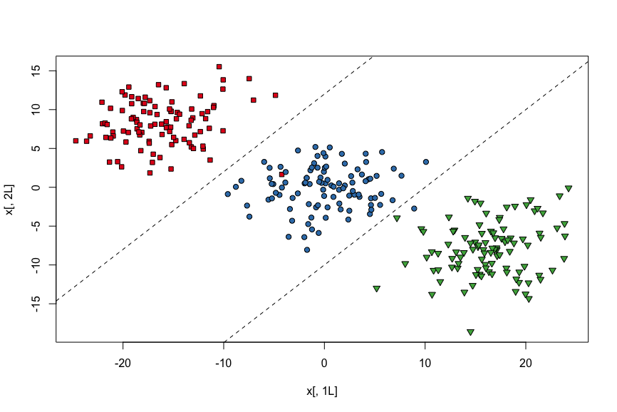
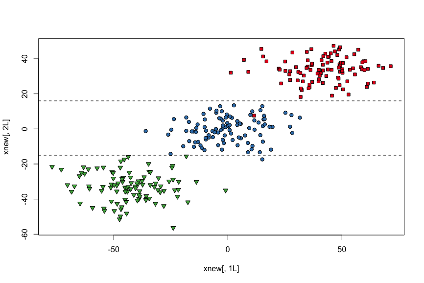

[](https://travis-ci.org/terrytangyuan/dml)
[](https://coveralls.io/r/terrytangyuan/dml?branch=master)
[](https://cran.r-project.org/package=dml)
[](https://cran.r-project.org/package=dml)
[](http://badges.mit-license.org)

# dml (Distance Metric Learning in R)

R package for a collection of *Distance Metric Learning* algorithms, including global and local methods such as *Relevant Component Analysis*, *Discriminative Component Analysis*, *Local Fisher Discriminant Analysis*, etc. These distance metric learning methods are widely applied in feature extraction, dimensionality reduction, clustering, classification, information retrieval, and computer vision problems.

## Installation

Install the current release from CRAN:

```r
install.packages("dml")
```

Or, try the latest development version from GitHub:

```r
devtools::install_github("terrytangyuan/dml")
```

## Examples

### Relevant Component Analysis

```r
library("MASS")

# generate synthetic multivariate normal data
set.seed(42)

k <- 100L # sample size of each class
n <- 3L # specify how many classes
N <- k * n # total sample size

x1 <- mvrnorm(k, mu = c(-16, 8), matrix(c(15, 1, 2, 10), ncol = 2))
x2 <- mvrnorm(k, mu = c(0, 0), matrix(c(15, 1, 2, 10), ncol = 2))
x3 <- mvrnorm(k, mu = c(16, -8), matrix(c(15, 1, 2, 10), ncol = 2))
x <- as.data.frame(rbind(x1, x2, x3)) # predictors
y <- gl(n, k) # response

# fully labeled data set with 3 classes
# need to use a line in 2D to classify
plot(x[, 1L], x[, 2L],
  bg = c("#E41A1C", "#377EB8", "#4DAF4A")[y],
  pch = rep(c(22, 21, 25), each = k)
)
abline(a = -10, b = 1, lty = 2)
abline(a = 12, b = 1, lty = 2)
```



```r
# generate synthetic chunklets
chunks <- vector("list", 300)
for (i in 1:100) chunks[[i]] <- sample(1L:100L, 10L)
for (i in 101:200) chunks[[i]] <- sample(101L:200L, 10L)
for (i in 201:300) chunks[[i]] <- sample(201L:300L, 10L)

chks <- x[unlist(chunks), ]

# make "chunklet" vector to feed the chunks argument
chunksvec <- rep(-1L, nrow(x))
for (i in 1L:length(chunks)) {
  for (j in 1L:length(chunks[[i]])) {
    chunksvec[chunks[[i]][j]] <- i
  }
}

# relevant component analysis
rcs <- rca(x, chunksvec)

# learned transformation of the data
rcs$A
#>           [,1]       [,2]
#> [1,] -3.181484 -0.8812647
#> [2,] -1.196200  2.3438640

# learned Mahalanobis distance metric
rcs$B
#>           [,1]     [,2]
#> [1,] 10.898467 1.740125
#> [2,]  1.740125 6.924592

# whitening transformation applied to the chunklets
chkTransformed <- as.matrix(chks) %*% rcs$A

# original data after applying RCA transformation
# easier to classify - using only horizontal lines
xnew <- rcs$newX
plot(xnew[, 1L], xnew[, 2L],
  bg = c("#E41A1C", "#377EB8", "#4DAF4A")[gl(n, k)],
  pch = c(rep(22, k), rep(21, k), rep(25, k))
)
abline(a = -15, b = 0, lty = 2)
abline(a = 16, b = 0, lty = 2)
```



### Other Examples

For examples of Local Fisher Discriminant Analysis, please take a look at the separate package [here](https://github.com/terrytangyuan/lfda). For examples of all other implemented algorithms, please take a look at the dml [package reference manual](https://cran.r-project.org/web/packages/dml/dml.pdf). 

## Brief Introduction

Distance metric is widely used in the machine learning literature. We used to choose a distance metric according to a priori (Euclidean Distance , L1 Distance, etc.) or according to the result of cross validation within small class of functions (e.g. choosing order of polynomial for a kernel). Actually, with priori knowledge of the data, we could learn a more suitable distance metric with (semi-)supervised distance metric learning techniques. dml is such an R package aims to implement a collection of algorithms for (semi-)supervised distance metric learning. These distance metric learning methods are widely applied in feature extraction, dimensionality reduction, clustering, classification, information retrieval, and computer vision problems.

## Algorithms

Algorithms planned in the first development stage:

  * Supervised Global Distance Metric Learning:
  
    * Relevant Component Analysis (RCA) - implemented
    * Kernel Relevant Component Analysis (KRCA)
    * Discriminative Component Analysis (DCA) - implemented
    * Kernel Discriminative Component Analysis (KDCA)
    * Global Distance Metric Learning by Convex Programming - implemented

  * Supervised Local Distance Metric Learning:

    * Local Fisher Discriminant Analysis - implemented
    * Kernel Local Fisher Discriminant Analysis - implemented
    * Information-Theoretic Metric Learning (ITML)
    * Large Margin Nearest Neighbor Classifier (LMNN)
    * Neighbourhood Components Analysis (NCA)
    * Localized Distance Metric Learning (LDM)

The algorithms and routines might be adjusted during developing.

## Contribute & Code of Conduct

To contribute to this project, please take a look at the [Contributing Guidelines](CONTRIBUTING.md) first. Please note that this project is released with a [Contributor Code of Conduct](CODE_OF_CONDUCT.md). By contributing to this project, you agree to abide by its terms.

## Contact

Contact the maintainer of this package:
Yuan Tang <terrytangyuan@gmail.com>
